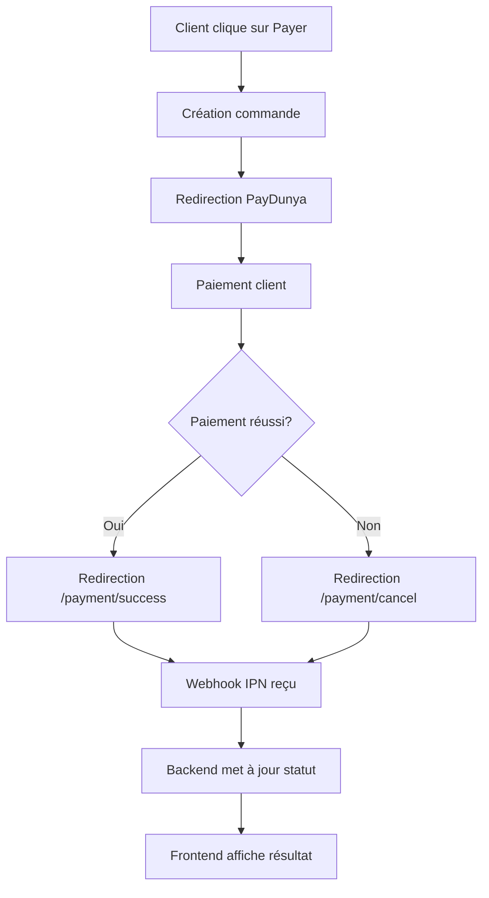

# 🚀 Documentation Frontend - Gestion Automatique des Paiements PayDunya

## 📋 Table des matières
1. [Vue d'ensemble](#vue-densemble)
2. [Flux de paiement complet](#flux-de-paiement-complet)
3. [Statuts de paiement](#statuts-de-paiement)
4. [Implementation React](#implementation-react)
5. [Gestion des redirections](#gestion-des-redirections)
6. [Exemples de code complets](#exemples-de-code-complets)
7. [Best practices](#best-practices)
8. [Gestion des erreurs](#gestion-des-erreurs)

---

## 🎯 Vue d'ensemble

Le système PayDunya gère **automatiquement** les statuts de paiement côté backend via :
- **Webhooks IPN** : Mise à jour en temps réel
- **Redirections** : Succès/Échec après paiement
- **Polling** : Vérification périodique du statut

**Important** : Le frontend n'a PAS besoin de mettre à jour manuellement les statuts - le backend s'en charge !

---

## 🔄 Flux de paiement complet



---

## 📊 Statuts de paiement

### Statuts possibles
| Statut | Signification | Affichage frontend |
|--------|---------------|-------------------|
| `PENDING` | En attente de paiement | ⏳ Paiement en cours... |
| `PAID` | Paiement réussi | ✅ Paiement effectué |
| `FAILED` | Paiement échoué | ❌ Paiement échoué |
| `CANCELLED` | Paiement annulé | 🚫 Paiement annulé |

### Quand les statuts changent-ils ?
- **`PENDING` → `PAID`** : Webhook IPN ou redirection succès
- **`PENDING` → `FAILED`** : Webhook IPN ou redirection échec
- **`PENDING` → `CANCELLED`** : Annulation client

---

## ⚛️ Implementation React

### 1. Composant de paiement

```jsx
import React, { useState, useEffect } from 'react';
import { axios } from 'axios';

const PaymentProcessor = ({ orderId, orderNumber, totalAmount }) => {
  const [paymentStatus, setPaymentStatus] = useState('PENDING');
  const [isLoading, setIsLoading] = useState(true);
  const [paymentUrl, setPaymentUrl] = useState(null);
  const [error, setError] = useState(null);

  // Vérifier le statut périodiquement
  useEffect(() => {
    if (paymentStatus === 'PENDING') {
      const interval = setInterval(async () => {
        try {
          const response = await axios.get(`/orders/${orderId}`);
          const status = response.data.paymentStatus;

          if (status !== paymentStatus) {
            setPaymentStatus(status);
            setIsLoading(false);
            if (status !== 'PENDING') {
              clearInterval(interval);
            }
          }
        } catch (err) {
          console.error('Erreur vérification statut:', err);
        }
      }, 3000); // Vérifier toutes les 3 secondes

      return () => clearInterval(interval);
    }
  }, [orderId, paymentStatus]);

  // Initialiser le paiement
  const handlePayment = async () => {
    try {
      setIsLoading(true);
      const response = await axios.post('/paydunya/payment', {
        invoice: {
          total_amount: totalAmount,
          description: `Commande ${orderNumber}`,
          customer: {
            name: 'Client Nom',
            email: 'client@email.com',
            phone: '775588834'
          }
        },
        actions: {
          cancel_url: `${window.location.origin}/payment/cancel`,
          return_url: `${window.location.origin}/payment/success`,
          callback_url: `${window.location.origin}/paydunya/webhook`
        },
        custom_data: {
          order_number: orderNumber,
          order_id: orderId
        }
      });

      setPaymentUrl(response.data.redirect_url);

      // Redirection vers PayDunya
      window.location.href = response.data.redirect_url;

    } catch (err) {
      setError('Erreur lors de l\'initialisation du paiement');
      setIsLoading(false);
    }
  };

  return (
    <div className="payment-container">
      {paymentStatus === 'PENDING' && (
        <div className="payment-pending">
          <h3>⏳ Paiement en attente</h3>
          <p>Votre commande est en attente de paiement.</p>
          {!paymentUrl && (
            <button
              onClick={handlePayment}
              disabled={isLoading}
              className="pay-button"
            >
              {isLoading ? 'Chargement...' : `Payer ${totalAmount} FCFA`}
            </button>
          )}
        </div>
      )}

      {paymentStatus === 'PAID' && (
        <div className="payment-success">
          <h3>✅ Paiement effectué avec succès</h3>
          <p>Merci pour votre paiement ! Votre commande est confirmée.</p>
          <div className="order-details">
            <p><strong>Commande:</strong> {orderNumber}</p>
            <p><strong>Montant:</strong> {totalAmount} FCFA</p>
          </div>
        </div>
      )}

      {paymentStatus === 'FAILED' && (
        <div className="payment-failed">
          <h3>❌ Paiement échoué</h3>
          <p>Une erreur est survenue lors du paiement.</p>
          <button onClick={handlePayment} className="retry-button">
            Réessayer le paiement
          </button>
        </div>
      )}

      {paymentStatus === 'CANCELLED' && (
        <div className="payment-cancelled">
          <h3>🚫 Paiement annulé</h3>
          <p>Vous avez annulé le paiement.</p>
          <button onClick={handlePayment} className="retry-button">
            Réessayer le paiement
          </button>
        </div>
      )}

      {error && (
        <div className="error-message">
          <p>❌ {error}</p>
        </div>
      )}
    </div>
  );
};

export default PaymentProcessor;
```

### 2. Hook personnalisé pour le suivi de paiement

```jsx
import { useState, useEffect } from 'react';
import axios from 'axios';

export const usePaymentTracker = (orderId) => {
  const [paymentStatus, setPaymentStatus] = useState('PENDING');
  const [isLoading, setIsLoading] = useState(true);
  const [error, setError] = useState(null);

  useEffect(() => {
    let interval;

    const checkPaymentStatus = async () => {
      try {
        const response = await axios.get(`/orders/${orderId}`);
        const { paymentStatus, paymentInfo } = response.data;

        setPaymentStatus(paymentStatus);
        setError(null);

        // Arrêter la vérification si le paiement est finalisé
        if (['PAID', 'FAILED', 'CANCELLED'].includes(paymentStatus)) {
          setIsLoading(false);
          if (interval) clearInterval(interval);
        }
      } catch (err) {
        setError(err.response?.data?.message || 'Erreur de vérification');
      }
    };

    if (orderId) {
      checkPaymentStatus(); // Vérification initiale
      interval = setInterval(checkPaymentStatus, 3000); // Toutes les 3 secondes
    }

    return () => {
      if (interval) clearInterval(interval);
    };
  }, [orderId]);

  return { paymentStatus, isLoading, error, setPaymentStatus };
};
```

---

## 🔀 Gestion des redirections

### Page de succès (`/payment/success`)

```jsx
import React, { useEffect } from 'react';
import { useNavigate, useSearchParams } from 'react-router-dom';

const PaymentSuccess = () => {
  const [searchParams] = useSearchParams();
  const navigate = useNavigate();
  const token = searchParams.get('token') || searchParams.get('invoice_token');
  const orderId = searchParams.get('order_id');

  useEffect(() => {
    if (token) {
      // Afficher le statut de succès
      // Le backend a déjà mis à jour la commande via le webhook
      console.log('Paiement réussi pour token:', token);

      // Rediriger vers la page de commande après 3 secondes
      setTimeout(() => {
        navigate(`/orders/${orderId}`);
      }, 3000);
    }
  }, [token, orderId, navigate]);

  return (
    <div className="payment-success-page">
      <div className="success-container">
        <div className="success-icon">✅</div>
        <h1>Paiement effectué avec succès !</h1>
        <p>Votre commande a été confirmée.</p>
        <p>Redirection vers votre commande en cours...</p>
      </div>
    </div>
  );
};
```

### Page d'échec (`/payment/cancel`)

```jsx
import React, { useEffect } from 'react';
import { useNavigate, useSearchParams } from 'react-router-dom';

const PaymentCancel = () => {
  const [searchParams] = useSearchParams();
  const navigate = useNavigate();
  const token = searchParams.get('token') || searchParams.get('invoice_token');
  const reason = searchParams.get('reason');

  useEffect(() => {
    if (token) {
      // Afficher le statut d'échec
      // Le backend a déjà mis à jour la commande via le webhook
      console.log('Paiement annulé pour token:', token, 'Raison:', reason);
    }
  }, [token, reason]);

  const handleRetry = () => {
    navigate(`/checkout`);
  };

  return (
    <div className="payment-cancel-page">
      <div className="cancel-container">
        <div className="cancel-icon">❌</div>
        <h1>Paiement annulé</h1>
        <p>
          {reason === 'User cancelled'
            ? 'Vous avez annulé le paiement.'
            : 'Le paiement n\'a pas pu être finalisé.'}
        </p>
        <button onClick={handleRetry} className="retry-button">
          Réessayer le paiement
        </button>
      </div>
    </div>
  );
};
```

---

## 💡 Exemples de code complets

### 1. Service API PayDunya

```javascript
// services/paydunyaService.js
import axios from 'axios';

const API_BASE_URL = process.env.REACT_APP_API_URL || 'http://localhost:3004';

class PaydunyaService {
  // Initialiser un paiement
  static async initiatePayment(orderData) {
    try {
      const response = await axios.post(`${API_BASE_URL}/paydunya/payment`, {
        invoice: {
          items: orderData.items,
          total_amount: orderData.totalAmount,
          description: `Commande ${orderData.orderNumber}`,
          customer: {
            name: orderData.customerName,
            email: orderData.customerEmail,
            phone: orderData.customerPhone
          }
        },
        store: {
          name: 'Printalma',
          tagline: 'Impression de qualité professionnelle',
          postal_address: 'Dakar, Sénégal',
          phone: '+221774322221'
        },
        actions: {
          cancel_url: `${window.location.origin}/payment/cancel`,
          return_url: `${window.location.origin}/payment/success`,
          callback_url: `${API_BASE_URL}/paydunya/webhook`
        },
        custom_data: {
          order_number: orderData.orderNumber,
          order_id: orderData.orderId
        }
      });

      return response.data;
    } catch (error) {
      throw new Error(error.response?.data?.message || 'Erreur lors de l\'initialisation du paiement');
    }
  }

  // Vérifier le statut d'un paiement
  static async checkPaymentStatus(token) {
    try {
      const response = await axios.get(`${API_BASE_URL}/paydunya/status/${token}`);
      return response.data;
    } catch (error) {
      throw new Error(error.response?.data?.message || 'Erreur lors de la vérification du statut');
    }
  }

  // Obtenir les détails d'une commande
  static async getOrderDetails(orderId) {
    try {
      const response = await axios.get(`${API_BASE_URL}/orders/${orderId}`);
      return response.data;
    } catch (error) {
      throw new Error(error.response?.data?.message || 'Erreur lors de la récupération de la commande');
    }
  }
}

export default PaydunyaService;
```

### 2. Contexte de paiement global

```jsx
// context/PaymentContext.js
import React, { createContext, useContext, useReducer, useEffect } from 'react';
import PaydunyaService from '../services/paydunyaService';

const PaymentContext = createContext();

const initialState = {
  currentOrder: null,
  paymentStatus: 'PENDING',
  isProcessing: false,
  error: null,
  paymentUrl: null
};

const paymentReducer = (state, action) => {
  switch (action.type) {
    case 'SET_ORDER':
      return { ...state, currentOrder: action.payload };
    case 'SET_PAYMENT_STATUS':
      return { ...state, paymentStatus: action.payload };
    case 'SET_PROCESSING':
      return { ...state, isProcessing: action.payload };
    case 'SET_ERROR':
      return { ...state, error: action.payload };
    case 'SET_PAYMENT_URL':
      return { ...state, paymentUrl: action.payload };
    case 'RESET':
      return initialState;
    default:
      return state;
  }
};

export const PaymentProvider = ({ children }) => {
  const [state, dispatch] = useReducer(paymentReducer, initialState);

  // Suivre le statut de paiement
  useEffect(() => {
    if (state.currentOrder && state.paymentStatus === 'PENDING') {
      const interval = setInterval(async () => {
        try {
          const orderDetails = await PaydunyaService.getOrderDetails(state.currentOrder.id);
          const newStatus = orderDetails.paymentStatus;

          if (newStatus !== state.paymentStatus) {
            dispatch({ type: 'SET_PAYMENT_STATUS', payload: newStatus });
          }

          // Arrêter le suivi si le paiement est finalisé
          if (['PAID', 'FAILED', 'CANCELLED'].includes(newStatus)) {
            clearInterval(interval);
          }
        } catch (error) {
          console.error('Erreur suivi paiement:', error);
        }
      }, 3000);

      return () => clearInterval(interval);
    }
  }, [state.currentOrder, state.paymentStatus]);

  // Initialiser un paiement
  const initiatePayment = async (orderData) => {
    try {
      dispatch({ type: 'SET_PROCESSING', payload: true });
      dispatch({ type: 'SET_ERROR', payload: null });

      const paymentResponse = await PaydunyaService.initiatePayment(orderData);

      dispatch({ type: 'SET_ORDER', payload: orderData });
      dispatch({ type: 'SET_PAYMENT_URL', payload: paymentResponse.data.redirect_url });

      // Rediriger vers PayDunya
      window.location.href = paymentResponse.data.redirect_url;

    } catch (error) {
      dispatch({ type: 'SET_ERROR', payload: error.message });
      dispatch({ type: 'SET_PROCESSING', payload: false });
    }
  };

  const value = {
    ...state,
    initiatePayment,
    resetPayment: () => dispatch({ type: 'RESET' })
  };

  return (
    <PaymentContext.Provider value={value}>
      {children}
    </PaymentContext.Provider>
  );
};

export const usePayment = () => {
  const context = useContext(PaymentContext);
  if (!context) {
    throw new Error('usePayment must be used within a PaymentProvider');
  }
  return context;
};
```

---

## 🎨 Best practices

### 1. Ne jamais stocker d'informations sensibles
```javascript
// ❌ À NE PAS FAIRE
const paymentData = {
  masterKey: 'votre_cle_secrete', // Jamais dans le frontend
  privateKey: 'votre_cle_privee'
};

// ✅ BONNE PRATIQUE
const paymentData = {
  orderId: '123',
  totalAmount: 15000
}; // Seules les données nécessaires
```

### 2. Gérer les états de chargement
```jsx
const PaymentButton = ({ isLoading, onClick, children }) => {
  return (
    <button
      onClick={onClick}
      disabled={isLoading}
      className={`pay-button ${isLoading ? 'loading' : ''}`}
    >
      {isLoading ? (
        <>
          <span className="spinner"></span>
          Traitement en cours...
        </>
      ) : (
        children
      )}
    </button>
  );
};
```

### 3. Notifications utilisateur
```jsx
const usePaymentNotifications = (paymentStatus) => {
  useEffect(() => {
    switch (paymentStatus) {
      case 'PAID':
        toast.success('✅ Paiement effectué avec succès !');
        break;
      case 'FAILED':
        toast.error('❌ Le paiement a échoué. Veuillez réessayer.');
        break;
      case 'CANCELLED':
        toast.info('🚫 Paiement annulé.');
        break;
      default:
        break;
    }
  }, [paymentStatus]);
};
```

---

## ⚠️ Gestion des erreurs

### Types d'erreurs courants

| Erreur | Cause | Solution |
|--------|-------|----------|
| `payment_init_failed` | Erreur création paiement PayDunya | Vérifier connexion API, données |
| `payment_timeout` | Timeout paiement PayDunya | Recommencer le paiement |
| `invalid_response` | Réponse invalide de PayDunya | Contacter le support |
| `network_error` | Problème réseau | Vérifier connexion internet |

### Composant de gestion d'erreurs

```jsx
const PaymentErrorHandler = ({ error, onRetry }) => {
  const getErrorMessage = (error) => {
    switch (error.code) {
      case 'payment_init_failed':
        return 'Impossible d\'initialiser le paiement. Veuillez réessayer.';
      case 'payment_timeout':
        return 'Le paiement a expiré. Veuillez recommencer.';
      case 'network_error':
        return 'Problème de connexion. Vérifiez votre internet.';
      default:
        return error.message || 'Une erreur est survenue.';
    }
  };

  return (
    <div className="payment-error">
      <div className="error-icon">⚠️</div>
      <h3>Erreur de paiement</h3>
      <p>{getErrorMessage(error)}</p>
      {onRetry && (
        <button onClick={onRetry} className="retry-button">
          Réessayer
        </button>
      )}
    </div>
  );
};
```

---

## 🔄 Résumé du workflow

1. **Client clique sur "Payer"**
   ```javascript
   await initiatePayment(orderData);
   ```

2. **Redirection automatique vers PayDunya**
   ```javascript
   window.location.href = paymentResponse.data.redirect_url;
   ```

3. **Paiement sur PayDunya**
   - Succès → Redirection vers `/payment/success`
   - Échec → Redirection vers `/payment/cancel`

4. **Webhook IPN automatique**
   - Backend met à jour le statut
   - Frontend détecte le changement via polling

5. **Affichage du résultat**
   - `PAID` → Page de succès
   - `FAILED` → Page d'échec avec retry
   - `CANCELLED` → Page d'annulation avec retry

**Le frontend n'a JAMAIS besoin de mettre à jour manuellement les statuts - tout est géré automatiquement par le backend !** 🎉