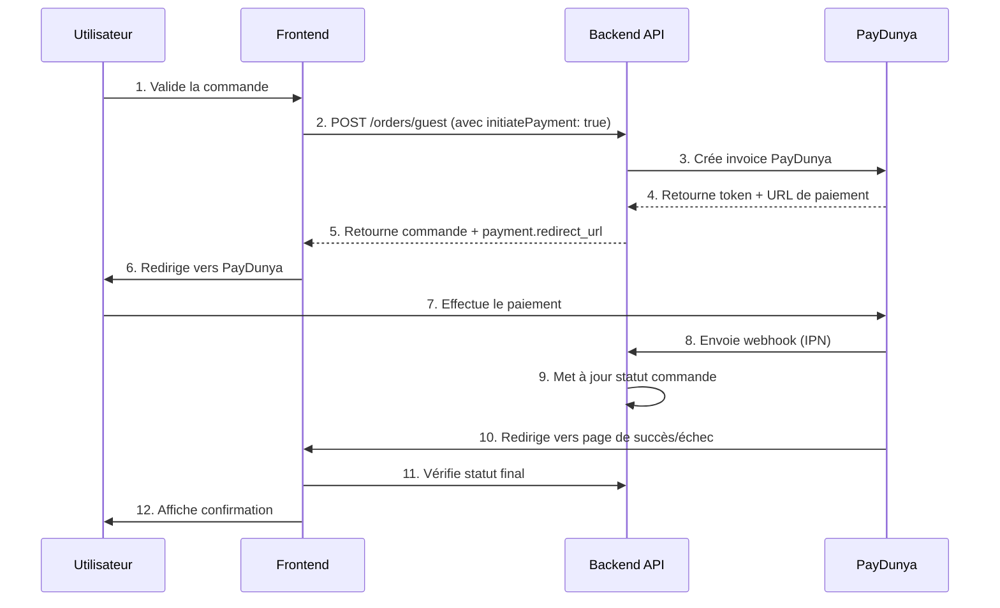

# 🎨 GUIDE D'INTÉGRATION FRONTEND - PAYDUNYA

**Version:** 1.0
**Date:** 05/11/2025
**Pour:** Développeurs Frontend (React/Vue/Angular)

---

## 📋 TABLE DES MATIÈRES

1. [Vue d'ensemble](#vue-densemble)
2. [Flux de paiement complet](#flux-de-paiement-complet)
3. [Endpoints API disponibles](#endpoints-api-disponibles)
4. [Créer une commande avec paiement](#créer-une-commande-avec-paiement)
5. [Gérer les redirections](#gérer-les-redirections)
6. [Vérifier le statut de paiement](#vérifier-le-statut-de-paiement)
7. [Gérer les erreurs](#gérer-les-erreurs)
8. [Composants React exemples](#composants-react-exemples)
9. [Variables d'environnement](#variables-denvironnement)
10. [Checklist d'intégration](#checklist-dintégration)

---

## 🎯 Vue d'ensemble

### Qu'est-ce que PayDunya ?

PayDunya est une plateforme de paiement mobile et en ligne en Afrique de l'Ouest qui permet d'accepter :
- 📱 Orange Money
- 💰 Wave
- 💳 Cartes bancaires (Visa, Mastercard)
- 📲 Free Money
- Et d'autres méthodes locales

### Architecture de l'intégration

```
┌─────────────┐         ┌─────────────┐         ┌──────────────┐
│  Frontend   │────1───>│   Backend   │────2───>│   PayDunya   │
│  (Client)   │         │    API      │         │   Servers    │
└─────────────┘         └─────────────┘         └──────────────┘
      │                        │                        │
      │<───────4───────────────┘                        │
      │                                                 │
      └────────────────────3──>Paiement<────────────────┘
```

**Flux:**
1. Frontend crée une commande via l'API Backend
2. Backend initialise le paiement avec PayDunya
3. Frontend redirige l'utilisateur vers PayDunya
4. Backend reçoit webhook et met à jour le statut
5. PayDunya redirige l'utilisateur vers le Frontend

---

## 🔄 Flux de paiement complet

### Étape par étape



---

## 🔌 Endpoints API disponibles

### Base URL

```
Production: https://api.printalma.com
Test: http://localhost:3004
```

### 1. Créer une commande invité avec paiement

**Endpoint:** `POST /orders/guest`

**Description:** Crée une commande et initialise automatiquement le paiement PayDunya

**Headers:**
```http
Content-Type: application/json
```

**Body:**
```json
{
  "email": "client@example.com",
  "phoneNumber": "+221775588834",
  "shippingDetails": {
    "firstName": "Prénom",
    "lastName": "Nom",
    "street": "Adresse complète",
    "city": "Dakar",
    "region": "Dakar",
    "postalCode": "12000",
    "country": "Sénégal"
  },
  "orderItems": [
    {
      "productId": 1,
      "quantity": 2,
      "unitPrice": 5000,
      "color": "Blanc",
      "size": "M"
    }
  ],
  "totalAmount": 10000,
  "notes": "Instructions spéciales (optionnel)",
  "paymentMethod": "PAYDUNYA",
  "initiatePayment": true
}
```

**Réponse Success (200):**
```json
{
  "success": true,
  "message": "Commande invité créée avec succès",
  "data": {
    "id": 87,
    "orderNumber": "ORD-1762366423948",
    "status": "PENDING",
    "paymentStatus": "PENDING",
    "totalAmount": 10000,
    "phoneNumber": "+221775588834",
    "email": "client@example.com",
    "shippingName": "Prénom Nom",
    "createdAt": "2025-11-05T18:13:43.951Z",
    "orderItems": [...],

    "payment": {
      "token": "test_GzRMdpCUqF",
      "redirect_url": "https://app.paydunya.com/sandbox-checkout/invoice/test_GzRMdpCUqF",
      "payment_url": "https://app.paydunya.com/sandbox-checkout/invoice/test_GzRMdpCUqF",
      "mode": "test"
    }
  }
}
```

**Champs importants de la réponse:**
- `data.id` : ID de la commande (à sauvegarder)
- `data.orderNumber` : Numéro de commande (à afficher à l'utilisateur)
- `data.payment.redirect_url` : **URL vers laquelle rediriger l'utilisateur**
- `data.payment.token` : Token PayDunya (pour vérification ultérieure)

---

### 2. Créer une commande utilisateur authentifié

**Endpoint:** `POST /orders`

**Headers:**
```http
Content-Type: application/json
Authorization: Bearer {JWT_TOKEN}
```

**Body:** Identique à `/orders/guest`

---

### 3. Vérifier le statut d'une commande

**Endpoint:** `GET /orders/{orderId}`

**Headers:**
```http
Authorization: Bearer {JWT_TOKEN}
```

**Réponse:**
```json
{
  "success": true,
  "data": {
    "id": 87,
    "orderNumber": "ORD-1762366423948",
    "status": "CONFIRMED",
    "paymentStatus": "PAID",
    "transactionId": "test_GzRMdpCUqF",
    "totalAmount": 10000,
    "payment_info": {
      "status": "PAID",
      "method": "PAYDUNYA",
      "transaction_id": "test_GzRMdpCUqF",
      "attempts_count": 1
    }
  }
}
```

**Statuts possibles:**
- `status`: `PENDING`, `CONFIRMED`, `SHIPPED`, `DELIVERED`, `CANCELLED`
- `paymentStatus`: `PENDING`, `PAID`, `FAILED`

---

### 4. Vérifier le statut de paiement PayDunya

**Endpoint:** `GET /paydunya/status/{token}`

**Description:** Interroge directement PayDunya pour le statut d'une facture

**Réponse:**
```json
{
  "success": true,
  "message": "Payment status retrieved successfully",
  "data": {
    "response_code": "00",
    "status": "completed",
    "token": "test_GzRMdpCUqF",
    "total_amount": 10000,
    "custom_data": {
      "orderNumber": "ORD-1762366423948",
      "orderId": 87
    }
  }
}
```

---

## 💻 Créer une commande avec paiement

### Exemple avec Fetch API

```javascript
async function createOrderWithPayment(orderData) {
  try {
    const response = await fetch('http://localhost:3004/orders/guest', {
      method: 'POST',
      headers: {
        'Content-Type': 'application/json',
      },
      body: JSON.stringify({
        email: orderData.email,
        phoneNumber: orderData.phoneNumber,
        shippingDetails: orderData.shippingDetails,
        orderItems: orderData.orderItems,
        totalAmount: orderData.totalAmount,
        notes: orderData.notes || '',
        paymentMethod: 'PAYDUNYA',
        initiatePayment: true, // ← Important !
      }),
    });

    const result = await response.json();

    if (result.success && result.data.payment) {
      // Sauvegarder les informations importantes
      localStorage.setItem('pendingOrderId', result.data.id);
      localStorage.setItem('pendingOrderNumber', result.data.orderNumber);
      localStorage.setItem('pendingPaymentToken', result.data.payment.token);

      // Rediriger vers PayDunya
      window.location.href = result.data.payment.redirect_url;
    } else {
      throw new Error(result.message || 'Erreur lors de la création de la commande');
    }
  } catch (error) {
    console.error('Erreur:', error);
    alert('Impossible de créer la commande. Veuillez réessayer.');
  }
}
```

### Exemple avec Axios

```javascript
import axios from 'axios';

async function createOrderWithPayment(orderData) {
  try {
    const response = await axios.post(
      'http://localhost:3004/orders/guest',
      {
        ...orderData,
        paymentMethod: 'PAYDUNYA',
        initiatePayment: true,
      }
    );

    const { data } = response.data;

    // Sauvegarder dans le localStorage ou state management
    localStorage.setItem('pendingOrderId', data.id);
    localStorage.setItem('pendingOrderNumber', data.orderNumber);
    localStorage.setItem('pendingPaymentToken', data.payment.token);

    // Rediriger vers PayDunya
    window.location.href = data.payment.redirect_url;
  } catch (error) {
    console.error('Erreur:', error.response?.data || error.message);
    throw error;
  }
}
```

---

## 🔀 Gérer les redirections

### Configuration des URLs de redirection

Les URLs de redirection sont configurées côté backend dans `.env` :

```env
PAYDUNYA_RETURN_URL="https://printalma.com/payment/success"
PAYDUNYA_CANCEL_URL="https://printalma.com/payment/cancel"
```

### Page de succès : `/payment/success`

Cette page est appelée après un paiement réussi.

**Query Parameters reçus:**
```
?token=test_GzRMdpCUqF&invoice_token=test_GzRMdpCUqF&order_id=87
```

**Exemple de composant React:**

```jsx
import { useEffect, useState } from 'react';
import { useSearchParams, useNavigate } from 'react-router-dom';
import axios from 'axios';

function PaymentSuccess() {
  const [searchParams] = useSearchParams();
  const navigate = useNavigate();
  const [loading, setLoading] = useState(true);
  const [orderData, setOrderData] = useState(null);
  const [error, setError] = useState(null);

  useEffect(() => {
    verifyPayment();
  }, []);

  async function verifyPayment() {
    try {
      // Récupérer les infos du localStorage
      const orderId = localStorage.getItem('pendingOrderId');
      const orderNumber = localStorage.getItem('pendingOrderNumber');
      const token = searchParams.get('token') || searchParams.get('invoice_token');

      if (!orderId || !token) {
        setError('Informations de paiement manquantes');
        setLoading(false);
        return;
      }

      // Vérifier le statut de la commande
      const response = await axios.get(`/orders/${orderId}`);
      const order = response.data.data;

      // Vérifier que le paiement est bien confirmé
      if (order.paymentStatus === 'PAID') {
        setOrderData(order);

        // Nettoyer le localStorage
        localStorage.removeItem('pendingOrderId');
        localStorage.removeItem('pendingOrderNumber');
        localStorage.removeItem('pendingPaymentToken');
      } else {
        // Le webhook n'a pas encore été traité, attendre un peu
        setTimeout(verifyPayment, 2000); // Réessayer après 2 secondes
        return;
      }

      setLoading(false);
    } catch (err) {
      console.error('Erreur vérification:', err);
      setError('Erreur lors de la vérification du paiement');
      setLoading(false);
    }
  }

  if (loading) {
    return (
      <div className="payment-loading">
        <div className="spinner"></div>
        <p>Vérification de votre paiement...</p>
        <p className="text-muted">Veuillez patienter</p>
      </div>
    );
  }

  if (error) {
    return (
      <div className="payment-error">
        <h2>❌ Erreur</h2>
        <p>{error}</p>
        <button onClick={() => navigate('/orders')}>
          Voir mes commandes
        </button>
      </div>
    );
  }

  return (
    <div className="payment-success">
      <div className="success-icon">✅</div>
      <h1>Paiement Confirmé !</h1>
      <p>Merci pour votre commande.</p>

      <div className="order-details">
        <h3>Détails de la commande</h3>
        <p><strong>Numéro:</strong> {orderData.orderNumber}</p>
        <p><strong>Montant:</strong> {orderData.totalAmount.toLocaleString()} FCFA</p>
        <p><strong>Statut:</strong> {orderData.status}</p>
        <p><strong>Transaction:</strong> {orderData.transactionId}</p>
      </div>

      <div className="actions">
        <button onClick={() => navigate(`/orders/${orderData.id}`)}>
          Voir la commande
        </button>
        <button onClick={() => navigate('/shop')}>
          Continuer mes achats
        </button>
      </div>
    </div>
  );
}

export default PaymentSuccess;
```

### Page d'annulation : `/payment/cancel`

**Query Parameters reçus:**
```
?token=test_GzRMdpCUqF&reason=user_cancelled
```

**Exemple de composant:**

```jsx
import { useEffect } from 'react';
import { useSearchParams, useNavigate } from 'react-router-dom';

function PaymentCancel() {
  const [searchParams] = useSearchParams();
  const navigate = useNavigate();
  const reason = searchParams.get('reason') || 'Paiement annulé';

  useEffect(() => {
    // Nettoyer le localStorage
    localStorage.removeItem('pendingPaymentToken');
  }, []);

  return (
    <div className="payment-cancel">
      <div className="cancel-icon">❌</div>
      <h1>Paiement Annulé</h1>
      <p>{reason}</p>

      <div className="actions">
        <button onClick={() => {
          const orderId = localStorage.getItem('pendingOrderId');
          if (orderId) {
            navigate(`/checkout?retry=${orderId}`);
          } else {
            navigate('/cart');
          }
        }}>
          Réessayer le paiement
        </button>

        <button onClick={() => navigate('/shop')}>
          Retour à la boutique
        </button>
      </div>
    </div>
  );
}

export default PaymentCancel;
```

---

## 🔍 Vérifier le statut de paiement

### Polling automatique

Après la redirection, vérifiez périodiquement le statut :

```javascript
function usePaymentStatus(orderId, maxAttempts = 10) {
  const [status, setStatus] = useState('checking');
  const [attempts, setAttempts] = useState(0);

  useEffect(() => {
    if (!orderId || attempts >= maxAttempts) return;

    const checkStatus = async () => {
      try {
        const response = await axios.get(`/orders/${orderId}`);
        const order = response.data.data;

        if (order.paymentStatus === 'PAID') {
          setStatus('paid');
        } else if (order.paymentStatus === 'FAILED') {
          setStatus('failed');
        } else {
          // Toujours en attente, réessayer
          setAttempts(prev => prev + 1);
          setTimeout(checkStatus, 3000); // Attendre 3 secondes
        }
      } catch (error) {
        console.error('Erreur vérification statut:', error);
        setStatus('error');
      }
    };

    checkStatus();
  }, [orderId, attempts, maxAttempts]);

  return status;
}

// Utilisation
function PaymentVerification({ orderId }) {
  const status = usePaymentStatus(orderId);

  if (status === 'checking') {
    return <div>Vérification du paiement...</div>;
  }

  if (status === 'paid') {
    return <div>✅ Paiement confirmé !</div>;
  }

  if (status === 'failed') {
    return <div>❌ Paiement échoué</div>;
  }

  return <div>⚠️ Erreur de vérification</div>;
}
```

---

## ⚠️ Gérer les erreurs

### Types d'erreurs possibles

#### 1. Erreur lors de la création de commande

```javascript
try {
  const response = await createOrderWithPayment(orderData);
} catch (error) {
  if (error.response?.status === 400) {
    // Données invalides
    alert('Veuillez vérifier vos informations');
  } else if (error.response?.status === 500) {
    // Erreur serveur
    alert('Erreur serveur. Veuillez réessayer plus tard.');
  } else {
    // Erreur réseau
    alert('Problème de connexion. Vérifiez votre connexion Internet.');
  }
}
```

#### 2. Paiement échoué

```javascript
if (order.paymentStatus === 'FAILED') {
  const failureReason = order.payment_info?.lastPaymentFailureReason;

  if (failureReason?.includes('insufficient')) {
    return (
      <div className="payment-failed">
        <p>💰 Fonds insuffisants</p>
        <p>Veuillez vérifier votre solde ou utiliser une autre méthode de paiement.</p>
        <button onClick={retryPayment}>Réessayer</button>
      </div>
    );
  } else {
    return (
      <div className="payment-failed">
        <p>❌ Paiement échoué</p>
        <p>Une erreur est survenue lors du paiement.</p>
        <button onClick={retryPayment}>Réessayer</button>
        <button onClick={contactSupport}>Contacter le support</button>
      </div>
    );
  }
}
```

#### 3. Timeout du webhook

Si après plusieurs vérifications le statut est toujours PENDING :

```javascript
if (attempts >= maxAttempts && order.paymentStatus === 'PENDING') {
  return (
    <div className="payment-pending">
      <p>⏳ Paiement en cours de traitement</p>
      <p>Votre paiement prend plus de temps que prévu.</p>
      <p>Vous recevrez un email de confirmation une fois le paiement validé.</p>
      <button onClick={() => navigate(`/orders/${orderId}`)}>
        Voir la commande
      </button>
    </div>
  );
}
```

---

## 🎨 Composants React exemples

### Composant de checkout complet

```jsx
import { useState } from 'react';
import { useNavigate } from 'react-router-dom';
import axios from 'axios';

function CheckoutPage() {
  const navigate = useNavigate();
  const [loading, setLoading] = useState(false);
  const [error, setError] = useState(null);

  const [formData, setFormData] = useState({
    email: '',
    phoneNumber: '',
    firstName: '',
    lastName: '',
    street: '',
    city: 'Dakar',
    region: 'Dakar',
    postalCode: '',
    country: 'Sénégal',
    notes: '',
  });

  const cart = [
    { productId: 1, quantity: 2, unitPrice: 5000, color: 'Blanc', size: 'M' }
  ];

  const totalAmount = cart.reduce((sum, item) => sum + item.unitPrice * item.quantity, 0);

  const handleSubmit = async (e) => {
    e.preventDefault();
    setLoading(true);
    setError(null);

    try {
      const response = await axios.post('http://localhost:3004/orders/guest', {
        email: formData.email,
        phoneNumber: formData.phoneNumber,
        shippingDetails: {
          firstName: formData.firstName,
          lastName: formData.lastName,
          street: formData.street,
          city: formData.city,
          region: formData.region,
          postalCode: formData.postalCode,
          country: formData.country,
        },
        orderItems: cart,
        totalAmount,
        notes: formData.notes,
        paymentMethod: 'PAYDUNYA',
        initiatePayment: true,
      });

      const { data } = response.data;

      // Sauvegarder les infos importantes
      localStorage.setItem('pendingOrderId', data.id);
      localStorage.setItem('pendingOrderNumber', data.orderNumber);
      localStorage.setItem('pendingPaymentToken', data.payment.token);

      // Rediriger vers PayDunya
      window.location.href = data.payment.redirect_url;
    } catch (err) {
      console.error('Erreur:', err);
      setError(err.response?.data?.message || 'Erreur lors de la création de la commande');
      setLoading(false);
    }
  };

  return (
    <div className="checkout-page">
      <h1>Finaliser ma commande</h1>

      {error && (
        <div className="alert alert-error">
          {error}
        </div>
      )}

      <form onSubmit={handleSubmit}>
        <section className="customer-info">
          <h2>Informations de contact</h2>

          <input
            type="email"
            placeholder="Email"
            value={formData.email}
            onChange={(e) => setFormData({ ...formData, email: e.target.value })}
            required
          />

          <input
            type="tel"
            placeholder="Téléphone (+221...)"
            value={formData.phoneNumber}
            onChange={(e) => setFormData({ ...formData, phoneNumber: e.target.value })}
            required
          />
        </section>

        <section className="shipping-info">
          <h2>Adresse de livraison</h2>

          <input
            type="text"
            placeholder="Prénom"
            value={formData.firstName}
            onChange={(e) => setFormData({ ...formData, firstName: e.target.value })}
            required
          />

          <input
            type="text"
            placeholder="Nom"
            value={formData.lastName}
            onChange={(e) => setFormData({ ...formData, lastName: e.target.value })}
            required
          />

          <input
            type="text"
            placeholder="Adresse complète"
            value={formData.street}
            onChange={(e) => setFormData({ ...formData, street: e.target.value })}
            required
          />

          <input
            type="text"
            placeholder="Ville"
            value={formData.city}
            onChange={(e) => setFormData({ ...formData, city: e.target.value })}
            required
          />

          <textarea
            placeholder="Instructions spéciales (optionnel)"
            value={formData.notes}
            onChange={(e) => setFormData({ ...formData, notes: e.target.value })}
          />
        </section>

        <section className="order-summary">
          <h2>Résumé de la commande</h2>
          {cart.map((item, index) => (
            <div key={index} className="cart-item">
              <span>{item.quantity}x Produit #{item.productId}</span>
              <span>{(item.quantity * item.unitPrice).toLocaleString()} FCFA</span>
            </div>
          ))}
          <div className="total">
            <strong>Total:</strong>
            <strong>{totalAmount.toLocaleString()} FCFA</strong>
          </div>
        </section>

        <button
          type="submit"
          disabled={loading}
          className="btn-pay"
        >
          {loading ? 'Traitement...' : `Payer ${totalAmount.toLocaleString()} FCFA`}
        </button>

        <div className="payment-methods">
          <p>Méthodes de paiement acceptées:</p>
          <div className="methods">
            
            
            
            
          </div>
        </div>
      </form>
    </div>
  );
}

export default CheckoutPage;
```

---

## 🔧 Variables d'environnement

### Fichier `.env` (Frontend)

```env
# API Backend
REACT_APP_API_URL=http://localhost:3004
# ou en production:
# REACT_APP_API_URL=https://api.printalma.com

# URLs de redirection (doivent correspondre au backend)
REACT_APP_PAYMENT_SUCCESS_URL=/payment/success
REACT_APP_PAYMENT_CANCEL_URL=/payment/cancel
```

### Utilisation dans le code

```javascript
const API_URL = process.env.REACT_APP_API_URL;

axios.post(`${API_URL}/orders/guest`, orderData);
```

---

## ✅ Checklist d'intégration

### Phase 1: Développement Local

- [ ] Créer les pages nécessaires:
  - [ ] Page de checkout
  - [ ] Page de succès (`/payment/success`)
  - [ ] Page d'annulation (`/payment/cancel`)
  - [ ] Page de détails de commande

- [ ] Implémenter la création de commande:
  - [ ] Formulaire de checkout
  - [ ] Validation des données
  - [ ] Appel API `POST /orders/guest`
  - [ ] Gestion des erreurs

- [ ] Implémenter la redirection:
  - [ ] Sauvegarder les infos dans localStorage
  - [ ] Rediriger vers `payment.redirect_url`

- [ ] Implémenter la vérification:
  - [ ] Page de succès avec vérification du statut
  - [ ] Polling pour attendre le webhook
  - [ ] Affichage des détails de commande

- [ ] Gérer les erreurs:
  - [ ] Page d'annulation
  - [ ] Messages d'erreur appropriés
  - [ ] Bouton de réessai

### Phase 2: Tests

- [ ] Tester le flux complet en local:
  - [ ] Créer une commande
  - [ ] Simuler le webhook avec le script de test
  - [ ] Vérifier que le statut est mis à jour
  - [ ] Vérifier l'affichage de confirmation

- [ ] Tester les cas d'erreur:
  - [ ] Paiement annulé
  - [ ] Paiement échoué
  - [ ] Fonds insuffisants
  - [ ] Problème réseau

### Phase 3: Production

- [ ] Configuration:
  - [ ] Mettre à jour `REACT_APP_API_URL` en production
  - [ ] Vérifier que les URLs de redirection sont correctes
  - [ ] Configurer HTTPS

- [ ] Test en production:
  - [ ] Test avec carte de test en sandbox
  - [ ] Vérifier que les webhooks sont reçus
  - [ ] Vérifier les redirections

- [ ] Déploiement:
  - [ ] Déployer le frontend
  - [ ] Tester le flux complet
  - [ ] Monitorer les erreurs

---

## 📊 Diagramme de statuts

```
Création de commande
        ↓
    [PENDING / PENDING]
        ↓
Client redirigé vers PayDunya
        ↓
   ┌────┴────┐
   ↓         ↓
Paie      Annule
   ↓         ↓
[CONFIRMED / PAID]  [PENDING / FAILED]
   ↓                     ↓
✅ Succès             ❌ Échec
```

---

## 🆘 Support et Dépannage

### Problèmes courants

#### 1. "payment" est undefined dans la réponse

**Cause:** `initiatePayment` n'est pas à `true` ou erreur PayDunya

**Solution:**
```javascript
// Vérifier avant de rediriger
if (!response.data.data.payment) {
  console.error('Aucun paiement initialisé:', response.data);
  alert('Erreur lors de l\'initialisation du paiement');
  return;
}
```

#### 2. Le statut ne se met pas à jour

**Cause:** Le webhook n'est pas reçu (problème localhost)

**Solution en local:**
- Utiliser le script de simulation: `./test-paydunya-webhook.sh`
- Ou utiliser ngrok pour exposer localhost

#### 3. CORS error

**Cause:** Le backend n'autorise pas le frontend

**Solution:** Vérifier la configuration CORS dans le backend:
```typescript
app.enableCors({
  origin: ['http://localhost:3000', 'https://printalma.com'],
  credentials: true,
});
```

#### 4. Le montant ne correspond pas

**Cause:** Calcul incorrect du total

**Solution:**
```javascript
const totalAmount = orderItems.reduce(
  (sum, item) => sum + (item.unitPrice * item.quantity),
  0
);
```

---

## 📝 Notes importantes

### Mode Test vs Production

En mode **TEST** (Sandbox):
- URL: `https://app.paydunya.com/sandbox-checkout/invoice/{token}`
- Utilisez les cartes de test
- Aucun argent réel n'est débité

En mode **PRODUCTION** (Live):
- URL: `https://app.paydunya.com/checkout/invoice/{token}`
- Argent réel débité
- Vérifier que `PAYDUNYA_MODE=live` dans le backend

### Sécurité

- ⚠️ Ne jamais stocker les clés PayDunya côté frontend
- ✅ Toutes les opérations PayDunya passent par le backend
- ✅ Valider toujours les données côté backend
- ✅ Utiliser HTTPS en production

### Performance

- Utiliser le polling avec modération (max 10 tentatives)
- Mettre en cache les informations de commande
- Afficher un loader pendant les opérations

---

## 🔗 Ressources

- **Documentation Backend:** `STRATEGIE_PAYDUNYA_WEBHOOK.md`
- **Script de test:** `test-paydunya-webhook.sh`
- **PayDunya Docs:** https://developers.paydunya.com/doc/FR/introduction
- **Support:** support@printalma.com

---

**Créé le:** 05/11/2025
**Auteur:** Équipe Backend Printalma
**Version:** 1.0

---

## 🎉 Prêt à intégrer !

Vous avez maintenant toutes les informations pour intégrer PayDunya dans votre frontend. En cas de problème, consultez les logs du backend ou contactez l'équipe technique.

Bon développement ! 🚀
