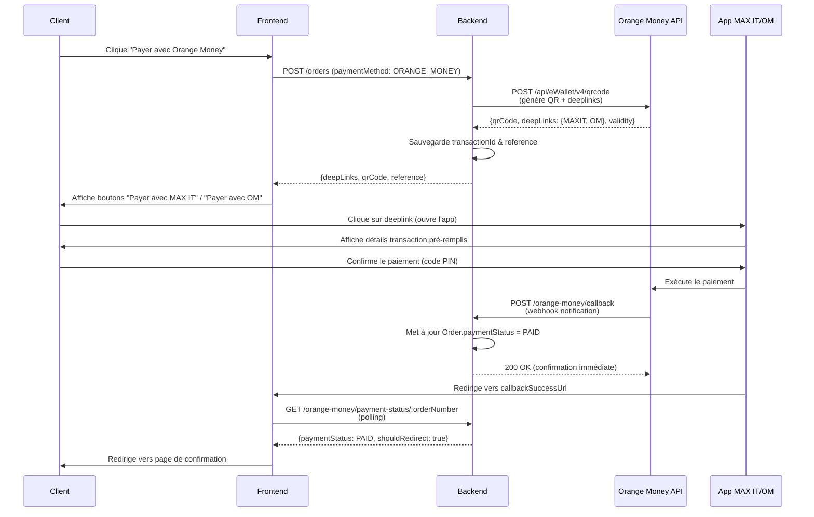

# Guide Complet: Orange Money Deeplinks + Callbacks

**Documentation officielle:** https://developer.orange-sonatel.com/documentation
**Basé sur:** Documentation PDF officielle Orange Money (Procédure QR CODE/Deeplink)

---

## 📋 Table des matières

1. [Vue d'ensemble](#vue-densemble)
2. [Flux de paiement complet](#flux-de-paiement-complet)
3. [Deeplinks: Ouvrir MAX IT ou Orange Money](#deeplinks)
4. [Callbacks: Vérifier le statut du paiement](#callbacks)
5. [Configuration du callback marchand](#configuration-callback)
6. [API de vérification de transaction](#verification-transaction)
7. [Tests et débogage](#tests)

---

## 🎯 Vue d'ensemble

Le paiement Orange Money avec **deeplinks** permet:
1. ✅ **Ouvrir directement l'app** MAX IT ou Orange Money depuis votre site/app
2. ✅ **Pré-remplir** le montant et le marchand
3. ✅ **Recevoir un callback** serveur-à-serveur quand le paiement est effectué
4. ✅ **Vérifier le statut** de manière proactive si nécessaire

---

## 🔄 Flux de paiement complet



---

## 🔗 Deeplinks: Ouvrir MAX IT ou Orange Money

### 1. Génération du paiement

**Endpoint backend:** `POST /orders`

**Code dans `orange-money.service.ts:152-255`:**

```typescript
async generatePayment(dto: CreateOrangePaymentDto) {
  const token = await this.getAccessToken();
  const merchantCode = '599241'; // Votre code marchand

  const FRONTEND_URL = 'https://printalma-website-dep.onrender.com';
  const BACKEND_URL = 'https://printalma-back-dep.onrender.com';
  const reference = `OM-${dto.orderNumber}-${Date.now()}`;

  const payload = {
    amount: {
      unit: 'XOF',
      value: dto.amount,
    },
    // URLs de redirection pour l'utilisateur (frontend)
    callbackCancelUrl: `${FRONTEND_URL}/payment/orange-money?orderNumber=${dto.orderNumber}&status=cancelled`,
    callbackSuccessUrl: `${FRONTEND_URL}/payment/orange-money?orderNumber=${dto.orderNumber}&status=success`,
    // URL de notification pour le webhook backend (serveur à serveur)
    notificationUrl: `${BACKEND_URL}/orange-money/callback`,
    code: merchantCode,
    metadata: {
      orderId: dto.orderId.toString(),
      orderNumber: dto.orderNumber,
      customerName: dto.customerName,
    },
    name: 'Printalma B2C',
    reference,
    validity: 600, // 10 minutes
  };

  const response = await axios.post(
    'https://api.orange-sonatel.com/api/eWallet/v4/qrcode',
    payload,
    {
      headers: {
        Authorization: `Bearer ${token}`,
        'Content-Type': 'application/json',
      },
    },
  );

  // ✅ Sauvegarder la référence dans transactionId
  await this.prisma.order.update({
    where: { id: dto.orderId },
    data: {
      transactionId: reference,
      paymentMethod: 'ORANGE_MONEY'
    }
  });

  return {
    qrCode: response.data.qrCode,  // QR Code en base64
    deepLinks: response.data.deepLinks,  // { MAXIT: "...", OM: "..." }
    validity: response.data.validity,
    reference,
  };
}
```

### 2. Utilisation des deeplinks côté frontend

**Réponse de l'API:**
```json
{
  "qrCode": "data:image/png;base64,iVBORw0KGgoAAAANSUhEUgAA...",
  "deepLinks": {
    "MAXIT": "https://sugu.orange-sonatel.com/en/dgjun_KudhPKtfthdzua",
    "OM": "https://orangemoneysn.page.link/rrzuoARuU7tK5uN6"
  },
  "validity": 600,
  "reference": "OM-ORDER-123-1234567890"
}
```

**Affichage frontend:**

```html
<div class="payment-options">
  <h3>Choisissez votre méthode de paiement</h3>

  <!-- Bouton MAX IT -->
  <a href="{{ deepLinks.MAXIT }}" class="btn-payment">
    
    <span>Payer avec MAX IT</span>
  </a>

  <!-- Bouton Orange Money -->
  <a href="{{ deepLinks.OM }}" class="btn-payment">
    
    <span>Payer avec Orange Money</span>
  </a>

  <!-- OU Scanner le QR Code -->
  <div class="qr-code">
    
    <p>Scannez avec MAX IT ou Orange Money</p>
  </div>
</div>
```

**Comportement:**
- Sur **mobile**: Le deeplink ouvre directement l'application MAX IT ou Orange Money
- Sur **desktop**: Afficher le QR Code à scanner

---

## 📞 Callbacks: Vérifier le statut du paiement

### 1. Configuration du webhook chez Orange Money

**⚠️ À FAIRE UNE FOIS lors du déploiement en production:**

```bash
POST /orange-money/register-callback
```

**Ou via code:**

```typescript
// orange-money.service.ts:295-370
async registerCallbackUrl() {
  const token = await this.getAccessToken();
  const merchantCode = '599241';
  const BACKEND_URL = 'https://printalma-back-dep.onrender.com';

  const callbackPayload = {
    apiKey: process.env.ORANGE_CALLBACK_API_KEY || 'PRINTALMA_API_KEY',
    code: merchantCode,
    name: 'Printalma B2C Payment Callback',
    callbackUrl: `${BACKEND_URL}/orange-money/callback`,
  };

  const response = await axios.post(
    'https://api.orange-sonatel.com/api/notification/v1/merchantcallback',
    callbackPayload,
    {
      headers: {
        Authorization: `Bearer ${token}`,
        'Content-Type': 'application/json',
      },
    },
  );

  return response.data;
}
```

### 2. Vérification de la configuration

```bash
GET /orange-money/verify-callback
```

**Réponse attendue:**
```json
{
  "success": true,
  "data": {
    "code": "599241",
    "name": "Printalma B2C Payment Callback",
    "callbackUrl": "https://printalma-back-dep.onrender.com/orange-money/callback"
  },
  "merchantCode": "599241",
  "mode": "production"
}
```

### 3. Réception du callback

**Endpoint:** `POST /orange-money/callback`

**Payload reçu d'Orange Money:**
```json
{
  "status": "SUCCESS",  // SUCCESS | FAILED | CANCELLED
  "transactionId": "TXN_123456789",
  "reference": "OM-ORDER-123-1234567890",
  "apiKey": "votre_api_key_secrete",
  "amount": {
    "unit": "XOF",
    "value": 10000
  },
  "code": "599241",
  "metadata": {
    "orderId": "123",
    "orderNumber": "ORDER-123",
    "customerName": "Jean Dupont"
  },
  "timestamp": "2026-02-23T10:30:45Z"
}
```

**Traitement du callback (`orange-money.service.ts:448-575`):**

```typescript
async handleCallback(payload: any): Promise<void> {
  this.logger.log('========== TRAITEMENT CALLBACK ORANGE MONEY ==========');

  // 1. VÉRIFICATION DE L'API KEY (SÉCURITÉ)
  const expectedApiKey = this.configService.get<string>('ORANGE_CALLBACK_API_KEY');

  if (expectedApiKey && payload.apiKey !== expectedApiKey) {
    this.logger.error('🚨 SÉCURITÉ: apiKey invalide dans le callback');
    throw new BadRequestException('Invalid API key');
  }

  // 2. EXTRAIRE LES DONNÉES
  const { status, transactionId, reference, metadata, amount, code } = payload;
  const orderNumber = metadata?.orderNumber;

  if (!orderNumber) {
    this.logger.error('❌ Callback sans orderNumber');
    return;
  }

  // 3. TROUVER LA COMMANDE
  const order = await this.prisma.order.findFirst({
    where: { orderNumber },
  });

  if (!order) {
    this.logger.error(`❌ Commande ${orderNumber} introuvable`);
    return;
  }

  // 4. VÉRIFICATION D'IDEMPOTENCE
  if (order.paymentStatus === 'PAID') {
    this.logger.warn('⚠️ IDEMPOTENCE: Callback déjà traité');
    return;
  }

  // 5. TRAITER SELON LE STATUT
  if (status === 'SUCCESS') {
    await this.prisma.order.update({
      where: { id: order.id },
      data: {
        paymentStatus: 'PAID',
        transactionId: transactionId || reference,
        paymentMethod: 'ORANGE_MONEY',
      },
    });

    this.logger.log(`✅✅✅ SUCCÈS: Commande ${orderNumber} marquée comme PAYÉE`);

    // TODO: Envoyer email de confirmation

  } else if (status === 'CANCELLED' || status === 'FAILED') {
    await this.prisma.order.update({
      where: { id: order.id },
      data: {
        paymentStatus: 'FAILED',
        transactionId: transactionId || reference,
        paymentMethod: 'ORANGE_MONEY',
      },
    });

    this.logger.log(`❌ Commande ${orderNumber} marquée comme ÉCHOUÉE`);

    // TODO: Notifier le client
  }
}
```

**⚠️ IMPORTANT:**
- Le callback retourne **200 OK immédiatement** pour éviter les retentatives d'Orange
- Le traitement se fait en arrière-plan avec `setImmediate()`

---

## 🔍 API de vérification de transaction

Si vous n'avez pas reçu de callback, vous pouvez vérifier le statut de manière proactive:

**Endpoint:** `GET /orange-money/verify-transaction/:transactionId`

**Exemple:**
```bash
GET /orange-money/verify-transaction/OM-ORDER-123-1234567890
```

**Réponse:**
```json
{
  "success": true,
  "transactionId": "OM-ORDER-123-1234567890",
  "status": "SUCCESS",
  "amount": 10000,
  "reference": "OM-ORDER-123-1234567890",
  "timestamp": "2026-02-23T10:30:45Z"
}
```

**⚠️ NOTE:** Cette API peut ne pas être disponible selon votre contrat avec Orange Money.

---

## 🔄 Polling côté frontend

Pour détecter quand le paiement est effectué, le frontend peut faire du polling:

**Endpoint:** `GET /orange-money/payment-status/:orderNumber`

**Exemple:**
```javascript
// Frontend - Polling toutes les 3 secondes
const pollPaymentStatus = async (orderNumber) => {
  const interval = setInterval(async () => {
    const response = await fetch(`/orange-money/payment-status/${orderNumber}`);
    const data = await response.json();

    if (data.shouldRedirect) {
      clearInterval(interval);
      window.location.href = data.redirectUrl;
    }
  }, 3000);

  // Arrêter après 5 minutes (timeout)
  setTimeout(() => clearInterval(interval), 300000);
};
```

**Réponse si déjà payé:**
```json
{
  "success": true,
  "orderNumber": "ORDER-123",
  "paymentStatus": "PAID",
  "transactionId": "TXN-123456",
  "shouldRedirect": true,
  "redirectUrl": "https://printalma-website-dep.onrender.com/payment/orange-money?orderNumber=ORDER-123&status=success",
  "message": "Cette commande a déjà été payée avec succès"
}
```

---

## 🧪 Tests et débogage

### 1. Tester la génération de deeplinks

```bash
POST /orders
Content-Type: application/json

{
  "items": [...],
  "totalAmount": 10000,
  "paymentMethod": "ORANGE_MONEY",
  "customerInfo": {
    "name": "Jean Dupont",
    "phone": "771234567",
    "email": "jean@example.com"
  }
}
```

**Vérifiez:**
- ✅ `deepLinks.MAXIT` et `deepLinks.OM` sont présents
- ✅ `qrCode` est en base64
- ✅ `reference` commence par "OM-"
- ✅ `Order.transactionId` est sauvegardé en DB

### 2. Simuler un callback SUCCESS

```bash
POST /orange-money/test-callback-success
Content-Type: application/json

{
  "orderNumber": "ORDER-123",
  "transactionId": "TXN-TEST-123456"
}
```

### 3. Simuler un callback FAILED

```bash
POST /orange-money/test-callback-failed
Content-Type: application/json

{
  "orderNumber": "ORDER-123"
}
```

### 4. Vérifier le statut d'une commande

```bash
GET /orange-money/payment-status/ORDER-123
```

### 5. Vérifier la configuration du callback

```bash
GET /orange-money/verify-callback
```

---

## 📚 Variables d'environnement requises

```env
# Orange Money Configuration
ORANGE_CLIENT_ID=b0c8057b-a23d-4284-886c-7508590e1f63
ORANGE_CLIENT_SECRET=7041e608-a3ab-45f3-b797-1b0330a52b66
ORANGE_MERCHANT_CODE=599241
ORANGE_MODE=production  # ou test

# Sécurité des callbacks
ORANGE_CALLBACK_API_KEY=votre_cle_secrete_ici

# URLs
BACKEND_URL=https://printalma-back-dep.onrender.com
FRONTEND_URL=https://printalma-website-dep.onrender.com
```

---

## ✅ Checklist de déploiement

- [ ] Variables d'environnement configurées
- [ ] Application créée sur le portail Orange Developer (production)
- [ ] Callback URL enregistré: `POST /orange-money/register-callback`
- [ ] Callback URL vérifié: `GET /orange-money/verify-callback`
- [ ] Test avec un vrai paiement en sandbox
- [ ] Test avec un vrai paiement en production (petit montant)
- [ ] Polling frontend implémenté
- [ ] Emails de confirmation configurés
- [ ] Logs de production activés

---

## 🆘 Support

**Documentation Orange Money:**
- Portail Developer: https://developer.orange-sonatel.com/
- Documentation API: https://developer.orange-sonatel.com/documentation
- Collection Postman: https://developer.orange-sonatel.com/qr-code

**Support Orange Money:**
- Email: partenaires.orangemoney@orange-sonatel.com

**Bugs dans votre code:**
- Vérifier les logs: `logs/orange-money.log`
- Activer le mode debug: `ORANGE_DEBUG=true`
