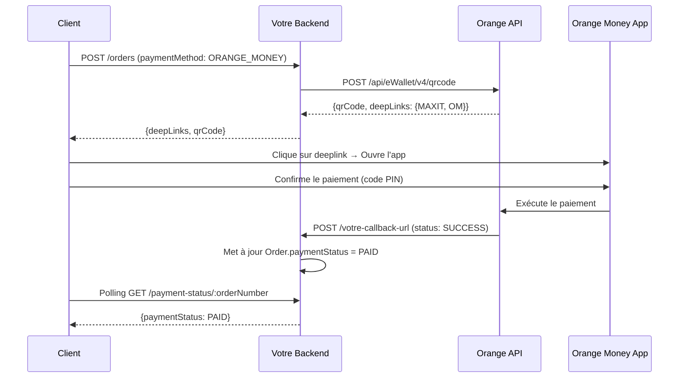

# API Orange Money - Documentation Réelle

**Basé sur la documentation officielle PDF**
**Portail:** https://developer.orange-sonatel.com/
**Documentation:** https://developer.orange-sonatel.com/documentation

---

## ⚠️ IMPORTANT - Ce qui existe VRAIMENT dans l'API

D'après la documentation officielle PDF fournie par Orange Money, voici les **SEULS** endpoints disponibles :

### ✅ Endpoints Disponibles

| Endpoint | Méthode | Description | Statut |
|----------|---------|-------------|--------|
| `/oauth/token` | POST | Authentification OAuth2 | ✅ Existe |
| `/api/eWallet/v4/qrcode` | POST | Génération QR Code + Deeplinks | ✅ Existe |
| `/api/notification/v1/merchantcallback` | POST | Configuration callback URL | ✅ Existe |
| `/api/notification/v1/merchantcallback?code={code}` | GET | Vérification callback | ✅ Existe |

### ❌ Endpoints qui N'EXISTENT PAS

| Endpoint | Raison |
|----------|--------|
| `/api/eWallet/v4/transactions` | ❌ **PAS dans la documentation officielle** |
| `/api/eWallet/v4/transactions/{id}/status` | ❌ **PAS dans la documentation officielle** |
| `/api/eWallet/v4/transactions/{id}` | ❌ **PAS dans la documentation officielle** |

---

## 🎯 Comment Vérifier le Statut d'un Paiement ?

**SEULE MÉTHODE DISPONIBLE : Le Callback Webhook**

Orange Money vous envoie une notification HTTP POST à votre `callbackUrl` quand le paiement est effectué.

### Flux de Paiement



---

## 📋 API 1: Authentification OAuth2

### POST /oauth/token

**URL Sandbox:**
```
https://api.sandbox.orange-sonatel.com/oauth/token
```

**URL Production:**
```
https://api.orange-sonatel.com/oauth/token
```

**Headers:**
```
Content-Type: application/x-www-form-urlencoded
```

**Body (form-data):**
```
grant_type=client_credentials
client_id={votre_client_id}
client_secret={votre_client_secret}
```

**Réponse:**
```json
{
  "access_token": "eyJhbGciOiJSUzI1NiIsInR5cCI...",
  "token_type": "Bearer",
  "expires_in": 3600
}
```

---

## 📋 API 2: Génération QR Code / Deeplinks

### POST /api/eWallet/v4/qrcode

**URL Sandbox:**
```
https://api.sandbox.orange-sonatel.com/api/eWallet/v4/qrcode
```

**URL Production:**
```
https://api.orange-sonatel.com/api/eWallet/v4/qrcode
```

**Headers:**
```
Authorization: Bearer {access_token}
Content-Type: application/json
```

**Body:**
```json
{
  "code": "478209",
  "name": "MY BUSINESS",
  "amount": {
    "unit": "XOF",
    "value": 10000
  },
  "reference": "myboutique",
  "metadata": {
    "idClient": "Client5"
  },
  "validity": 300
}
```

**Réponse:**
```json
{
  "deepLinks": {
    "MAXIT": "https://sugu.orange-sonatel.com/en/dgjun_KudhPKtfthdzua",
    "OM": "https://orangemoneysn.page.link/rrzuoARuU7tK5uN6"
  },
  "qrCode": "data:image/png;base64,iVBORw0KGgoAAAANSUhEUgAA...",
  "validity": 300
}
```

---

## 📋 API 3: Configuration du Callback

### POST /api/notification/v1/merchantcallback

**URL Sandbox:**
```
https://api.sandbox.orange-sonatel.com/api/notification/v1/merchantcallback
```

**URL Production:**
```
https://api.orange-sonatel.com/api/notification/v1/merchantcallback
```

**Headers:**
```
Authorization: Bearer {access_token}
Content-Type: application/json
```

**Body:**
```json
{
  "apiKey": "xyz",
  "code": "123456",
  "name": "Callback configuration Test",
  "callbackUrl": "https://my-callback-url.com"
}
```

**Réponse (Code 201):**
```json
{
  "message": "Merchant callback created"
}
```

---

## 📋 API 4: Vérification du Callback

### GET /api/notification/v1/merchantcallback?code={merchantCode}

**URL Sandbox:**
```
https://api.sandbox.orange-sonatel.com/api/notification/v1/merchantcallback?code=123456
```

**URL Production:**
```
https://api.orange-sonatel.com/api/notification/v1/merchantcallback?code=123456
```

**Headers:**
```
Authorization: Bearer {access_token}
```

**Réponse:**
```json
{
  "code": "123456",
  "name": "Callback configuration Test",
  "callbackUrl": "https://my-callback-url.com"
}
```

---

## 📞 Format du Callback Webhook

Quand un paiement est effectué, Orange Money envoie une notification à votre `callbackUrl` :

### POST {votre_callback_url}

**Body (JSON):**
```json
{
  "status": "SUCCESS",
  "transactionId": "TXN_123456789",
  "reference": "OM-ORDER-123-1234567890",
  "apiKey": "votre_api_key_secrete",
  "amount": {
    "unit": "XOF",
    "value": 10000
  },
  "code": "478209",
  "metadata": {
    "orderId": "123",
    "orderNumber": "ORDER-123",
    "customerName": "Jean Dupont"
  },
  "timestamp": "2026-02-23T10:30:45Z"
}
```

### Statuts Possibles

| Statut | Signification | Action à prendre |
|--------|---------------|------------------|
| `SUCCESS` | Paiement réussi | Marquer la commande comme PAID |
| `FAILED` | Paiement échoué | Marquer comme FAILED |
| `CANCELLED` | Annulé par le client | Marquer comme CANCELLED |
| `PENDING` | En attente | Attendre un autre callback |

---

## 🔐 Sécurité du Callback

1. **Vérifier l'apiKey** dans le payload reçu
2. **Retourner 200 OK immédiatement** pour éviter les retentatives
3. **Traiter le callback de manière asynchrone**
4. **Implémenter l'idempotence** (ne pas traiter deux fois le même callback)

---

## 🚫 Ce qui N'EXISTE PAS

### ❌ Vérification Proactive du Statut

**Il n'y a PAS d'endpoint pour interroger le statut d'une transaction !**

Vous **NE POUVEZ PAS** :
- ❌ GET /api/eWallet/v4/transactions/{id}/status
- ❌ GET /api/eWallet/v4/transactions
- ❌ Interroger Orange Money pour savoir si un paiement a été effectué

**SEULE SOLUTION : Attendre le callback webhook**

### Solutions de Contournement

Si vous n'avez pas reçu de callback :

1. **Polling sur votre propre BDD** :
   ```
   GET /orange-money/payment-status/:orderNumber
   ```
   → Lit le statut depuis VOTRE base de données (mis à jour par le callback)

2. **Contacter le support Orange Money** pour vérifier manuellement

3. **Configurer des alertes** pour les paiements en attente > X minutes

---

## 📝 Endpoints de Votre Backend

Voici les endpoints que vous devriez implémenter côté backend :

| Endpoint | Description | Source de données |
|----------|-------------|-------------------|
| `POST /orange-money/payment` | Génère QR + Deeplinks | API Orange Money |
| `POST /orange-money/callback` | Reçoit les notifications | Appelé par Orange Money |
| `GET /orange-money/payment-status/:orderNumber` | Vérifie le statut | VOTRE base de données |
| `POST /orange-money/register-callback` | Configure l'URL de callback | API Orange Money |
| `GET /orange-money/verify-callback` | Vérifie l'URL enregistrée | API Orange Money |

---

## ✅ Checklist d'Intégration

- [ ] Application créée sur https://developer.orange-sonatel.com/
- [ ] Client ID et Client Secret récupérés
- [ ] Endpoint OAuth2 fonctionnel (GET /test-connection)
- [ ] Génération de QR/Deeplinks fonctionnelle
- [ ] Callback URL enregistré (`POST /register-callback`)
- [ ] Callback URL vérifié (`GET /verify-callback`)
- [ ] Endpoint de callback implémenté (`POST /callback`)
- [ ] Vérification de l'apiKey dans le callback
- [ ] Idempotence implémentée (pas de double traitement)
- [ ] Polling frontend sur `/payment-status/:orderNumber`
- [ ] Tests en sandbox réussis
- [ ] Tests en production avec petit montant

---

## 📞 Support

**Email:** partenaires.orangemoney@orange-sonatel.com
**Documentation:** https://developer.orange-sonatel.com/documentation
**Collection Postman:** https://developer.orange-sonatel.com/qr-code

---

## 🎯 Conclusion

**L'API Orange Money est SIMPLE :**
1. Vous générez un QR/Deeplink
2. Le client paie
3. Orange vous envoie un callback
4. Vous mettez à jour votre BDD

**Il n'y a PAS d'API de vérification proactive du statut !**
Tout repose sur le **callback webhook**.
